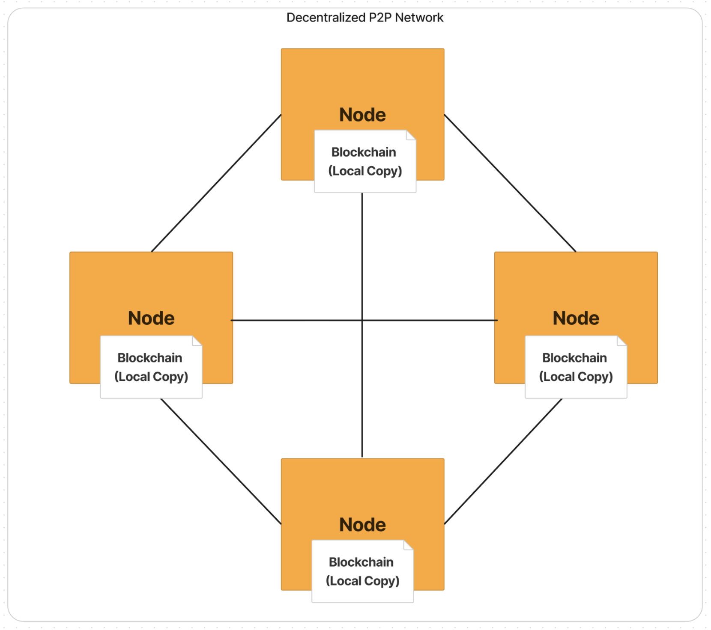
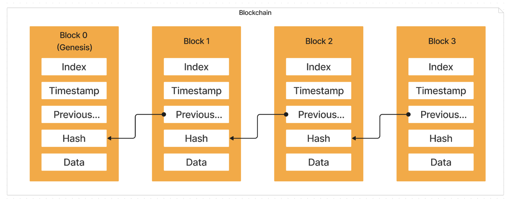

# Decentralized Blockchain Network with Python

This repository contains a decentralized blockchain network built in Python. The project provides a foundational understanding of how blockchain technology works, from core transaction management to node synchronization in a peer-to-peer network.




## Table of Contents
- [Overview](#overview)
- [Features](#features)
- [Installation](#installation)
- [Usage](#usage)
- [File Descriptions](#file-descriptions)
- [Contributing](#contributing)
- [License](#license)

## Overview
This project demonstrates a simple, yet functional, blockchain system. It covers:
- Basic blockchain mechanics such as proof of work, transactions, and mining.
- A peer-to-peer network of nodes that communicate over RESTful APIs.
- A wallet system that allows users to create transactions using public/private keys.

## Features
- **Blockchain**: Implements blocks, transactions, proof of work, and mining.
- **Node Network**: Peer-to-peer nodes capable of broadcasting and synchronizing the blockchain.
- **Wallet**: Public/private key pair generation to sign transactions.
- **REST API**: Node APIs for interacting with the blockchain, sending transactions, and querying data.

## Installation

1. Clone the repository:
    ```bash
    git clone https://github.com/adriancamaj/Decentralized-Blockchain-Python.git
    ```
2. Navigate into the project directory:
    ```bash
    cd Decentralized-Blockchain-Python
    ```
3. Install the necessary dependencies:
    ```bash
    pip install -r requirements.txt
    ```

## Usage

1. Run a node:
    ```bash
    python Main.py
    ```

2. Use the API to interact with the blockchain. The API allows for sending transactions, mining blocks, and more. You can access it through any REST client (e.g., Postman).

## File Descriptions

Below is an overview of the main files in this project:

### Core Files

1. **`Blockchain.py`**:
    - Contains the `Blockchain` class which handles block creation, transaction verification, and proof of work.

2. **`BlockchainUtils.py`**:
    - Provides utility functions to aid in blockchain operations such as encoding and hashing data.

3. **`Main.py`**:
    - The main entry point to run the blockchain node. It sets up the node, initiates the network, and starts the API server.

4. **`Message.py`**:
    - Defines message structures used for communication between nodes.

5. **`Node.py`**:
    - Implements the `Node` class, which represents a node in the blockchain network. It handles node-to-node communication.

6. **`NodeAPI.py`**:
    - Contains the RESTful API implementation for the node. This exposes various endpoints for interacting with the blockchain.

7. **`Test.py`**:
    - Includes test cases to validate the blockchain's functionality and ensure correct behavior of the node network.

8. **`Transaction.py`**:
    - Defines the structure and logic for creating and validating transactions within the blockchain.

9. **`TransactionPool.py`**:
    - Manages the transaction pool, where unconfirmed transactions reside until they are added to a block.

10. **`Wallet.py`**:
    - Implements the `Wallet` class which creates public/private key pairs for generating and signing transactions.

### Additional Files

11. **`Interaction.py`**:
    - Defines logic for user interactions with the blockchain, such as submitting transactions or mining requests.

12. **`Lot.py`**:
    - Implements the `Lot` class, which helps in managing the Proof of Stake (PoS) system by defining staking logic and rewards.

13. **`PeerDiscoveryHandler.py`**:
    - Handles peer discovery in the network, enabling nodes to find and connect with each other.

14. **`ProofOfStake.py`**:
    - Implements the Proof of Stake (PoS) consensus mechanism, managing staking, block creation, and node selection for mining.

15. **`SocketCommunication.py`**:
    - Manages socket communication between nodes, enabling peer-to-peer data exchange and blockchain synchronization.

16. **`SocketConnector.py`**:
    - Handles the establishment and management of socket connections between nodes in the blockchain network.

### PEM Key Files

17. **`stakerPrivateKey.pem`**:
    - The private key used by the staker for signing transactions and managing stake in the network.

18. **`genesisPublicKey.pem`**:
    - The public key of the genesis node, used to verify the authenticity of the genesis block.

19. **`genesisPrivateKey.pem`**:
    - The private key of the genesis node, used to sign the initial block and transactions.

## Contributing
Contributions are welcome! If you have any suggestions or improvements, please create a pull request or open an issue.

## License
This project is licensed under the MIT License. See the `LICENSE` file for more details.
